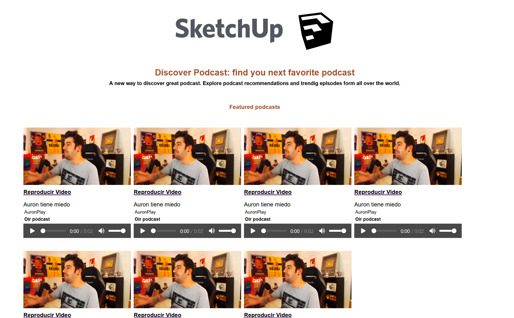

# Evaluación UD7 - Elementos multimedia

Una empresa de "podcasting" nos ha pedido que realicemos un diseño similar al siguiente:

Sin embargo las fotografías que nos ha entregado tienen un tamaño excesivamente grande, por lo que deberemos redimensionarlas a un tamaño adecuado (se debe calcular y jusificar su medida).

Cuando pulsemos sobre el botón de muestra se debe reproducir una muestra del podcast (audio.mp3), y cuando hagamos clic sobre la imagen se debe abrir una nueva ventana y reproducir el video centrado en la ventana del navegador con una resolución de 600px de ancho (video.mp4).

Además nos han proporcionado un logo que deberemos editar para que el isologo y el logotipo estén cómo nos lo pide el cliente.

## Lo que debemos obtener

[Pulsa Aquí](./Evaluacion/multimedia/ExamenUD7.mkv)

Debes entregar:

- Documento que contenga:
  - Justificación del tamaño de la imagen
  - Comando usado para redimensionar la imagen
  - Capturas de pantalla y breve explicación del proceso de modificación de la imagen.
- Carpeta con la solución propuesta de la web, con el siguiente contenido:
  - Documento HTML
  - CSS
  - Imágenes
  - Logos modificados
  - Recursos multimedia

Suerte.

- 